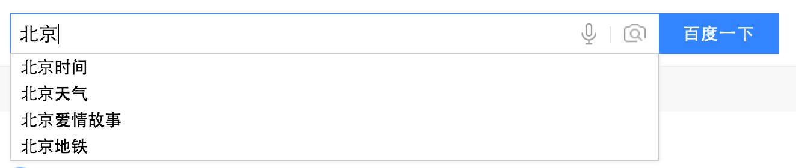
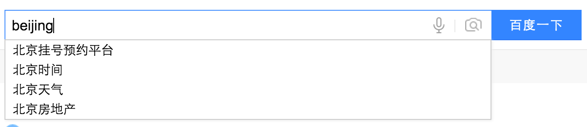

# hello-world
A place where I store my ideas, something I want to achieve.

I like to find something new and meaningful in my daily life and try to do something to improve myself.

2016.3.14 

* 拼音索引

其实这个理解起来也是很简单的，就是我现在有一个文本输入框，我输入中文会有提示，输入拼音也有提示，现在的浏览器都有这样的功能实现：

比如说输入北京：

同样，输入拼音也应给出提示：

这个还可以划分出一个刚小的任务，就是先写一个简单的爬虫程序，得到浏览器可能的智能提示，这个我之前写过，但基本忘了，可以再琢磨琢磨。

* 快速字符串匹配

这个应该是女票经常给我说的一个问题，去年年末我俩都换了 6S，她总是给我抱怨 iPhone 没有小米好用，其中的一个原因就是：

在搜索手机中的联系人时候，会有以下两种需求：

1. 我们都是学生党，同一个学校的手机号码基本短号，而我的手机里面存的是那个人的电话号码完整的11位，短号呢，前两位基本固定61、67此类，现在当我输入后四位，我希望能在我输入数字的时候给出匹配的联系人，以帮助我想起这是谁的短号，这样更方便，而不是要求我去将短号补全称完整的11位再去查询；
2. 在联系人页面，有一个搜索框，例如现在我一个同学找我要另一个同学 `令狐冲（linghuchong）` 的电话号码，我一般使用拼音输入法输入中文汉字，现在通讯录也一般有了我输入拼音 `linghuchong` 它就会给出一些匹配的联系人，我现在有另一个需求，就是希望我输入拼音首字母 `lhc` 也能给出我智能提示。